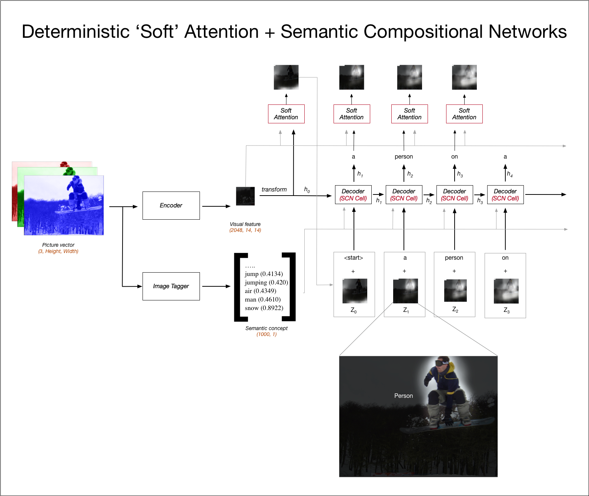

# Indonesian Image Captioning

Built using **[PyTorch](https://pytorch.org)**

> Pembangkitan Deskripsi Gambar Bahasa Indonesia

## Paper

### Coming soon

_Baseline paper_ : [Semantic Compositional Networks for Visual Captioning](https://arxiv.org/pdf/1611.08002v2.pdf)

## Overview

1. [Install prerequisites](#prerequisites)

   Before installing project make sure the following prerequisites have been met.

   > Sebelum memasang dan menjalankan proyek ini, pastikan segala kebutuhan sudah terpenuhi

2. [Examples](#examples)

   See how caption is being generated

   > Lihat cara deksripsi gambar dibangkitkan

3. [Project Tree](#project-tree)

   File and directory structure of this project

   > Struktur direktori dan berkas

4. [Install and Running the project](#install-and-running-the-project)

   Way to run and develop the project

   > Cara menjalankan dan mengembangkan proyek ini

5. [How it works](#how-it-works)

   How the model implemented and works

   > Cara model diimplementasikan dan cara kerja

6. [Possible Future Development](#possible-future-development)

   Possible enhancement and development in the future

   > Kemungkinan peningkatan kualitas and pengembangan di masa depan

7. [Author and Credits](#author)

   See man behind the project and other people that contribute to this project

   > Orang di belakang proyek dan orang-orang lain yang berkontribusi

---

### Prerequisites

What things you need to install this project and how to install them

#### Library

- [Python 3.4 or More](https://www.python.org) for Programming Language

- [Pytorch](https://pytorch.org/get-started) for Deep Neural Network Framework

- [Torchvision](https://pytorch.org/docs/stable/torchvision/index.html) for ResNet152 Architecture

- [Nlg-Eval](https://github.com/Maluuba/nlg-eval) for evaluation metrics

> This project used BLEU, ROUGE, METEOR, nad CIDEr-D as evaluation metrics
>
> > METEOR and CIDEr-D is not used because there is no implementation of METEOR and CIDEr-D in Indonesian Language

#### Pretrained Model

You can download pretrained models and scn_data from [THIS LINK](http://bit.ly/AttentionSCN_ID)

> Just copy the `pretrained` and `scn_data` folder into this project

---

### Examples

<div align="center">
    
    
</div>

---

### Project tree

```sh
.
├── pretrained # download and save pretrained models here
├── scn_data   # folder contains files generated by create_input_files.py
├── datasets   # dataset loader for generate train, eval, test
│   ├── caption.py # caption dataset loader
│   └── tag.py # tag dataset loader
├── models # all models implementation
│   ├── decoders # all models implementation
│   │   ├── attention_scn.py # all models implementation
│   │   ├── pure_attention.py # all models implementation
│   │   └── pure_scn.py
│   ├── encoders
│   │   ├── caption.py # all models implementation
│   │   └── tagger.py
│   ├── attention.py
│   └── scn_cell.py
├── trains # all training implementation
│   ├── attention_scn.py
│   ├── pure_attention.py
│   ├── pure_scn.py
│   └── tagger.py
├── utils
│   ├── checkpoint.py
│   ├── dataset.py
│   ├── device.py
│   └── embedding.py
│   ├── loader.py
│   ├── metric.py
│   ├── optimizer.py
│   └── tensor.py
│   ├── token.py
│   ├── url.py
│   └── vizualize.py
├── corpus_score.py # corpus scoring using perplexity and vocab count
├── create_input_files.py  # preprocess input files and split data
├── eval_caption.py # caption model evaluation script
├── eval_tagger.py # image tagger model evaluation script
├── inference.py # caption generator script
├── README.md  # this file
└── train.py # training script
```

---

### Install and Running the project

```bash
git clone https://github.com/rayandrews/semantic-compositional-nets-attention.git
cd semantic-compositional-nets-attention
```

---

### How It Works

By combining two architecture: **SCN** by [zhegan27](https://github.com/zhegan27/Semantic_Compositional_Nets/) and **Soft Attention** by [kelvinxu](https://github.com/kelvinxu/arctic-captions)

#### Architecture



#### Params

##### Default Params

| Parameters           | Value |
| -------------------- | ----: |
| _Semantic Concept_   |  1000 |
| _Caption Per Image_  |     5 |
| _Min Word Freq_      |     5 |
| _Max Caption Length_ |    50 |

##### Image Tagger

| Parameters      | Value |
| --------------- | ----: |
| _Epoch_         |    10 |
| _Batch Size_    |    32 |
| _Learning Rate_ |  1e-4 |
| _Dropout_       |  0.15 |
| _Optimizer_     |  Adam |

##### Caption Model

| Parameters      | SCN  | SCN + Attention |
| --------------- | :--: | --------------: |
| _Epoch_         |  12  |              12 |
| _Batch Size_    |  32  |              32 |
| _Learning Rate_ | 4e-4 |            4e-4 |
| _Dropout_       | 0.5  |             0.5 |
| _Optimizer_     | Adam |            Adam |
| _Embedding_     | 512  |             512 |
| _Attention_     |  -   |             512 |
| _Factor_        | 512  |             512 |
| _Decoder_       | 512  |             512 |

---

### Possible Future Development

- Change Soft Attention to Transformer [Attention is All You Need](https://papers.nips.cc/paper/7181-attention-is-all-you-need.pdf)
- Change baseline
- Preprocess and reevaluate Indonesian dataset

---

### Author

- **Ray Andrew** - [Github](https://github.com/rayandrews) - [Linkedin](https://linkedin.com/in/ray-andrew/) - [Email](mailto:raydreww@gmail.com)

### Credits

#### Supervisors

- [Achmad Imam Kistijantoro, ST., MT., Ph.D](https://stei.itb.ac.id/id/sekilas/staf-dosen/imam/)

- [Dr. Eng. Ayu Purwarianti, ST.,MT.](https://stei.itb.ac.id/id/sekilas/staf-dosen/ayu/)

#### Others

- [zhegan27](https://github.com/zhegan27/Semantic_Compositional_Nets/) as the base implementation for SCN Paper

- [kelvinxu](https://github.com/kelvinxu/arctic-captions) as the base implementation of Attention Networks ~ Show, Attend, and Tell

- [sgrvinod](https://github.com/sgrvinod/a-PyTorch-Tutorial-to-Image-Captioning) as the base of this project with Show Attend and Tell Implementation are taken from him.
